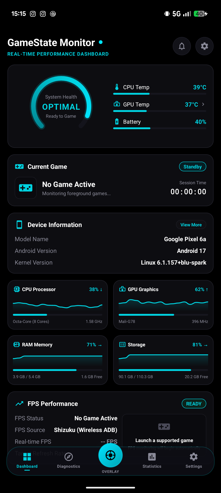
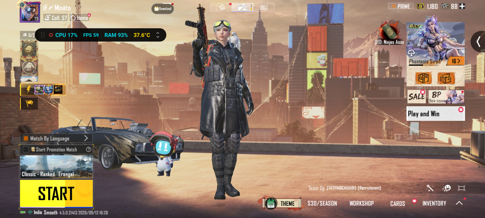
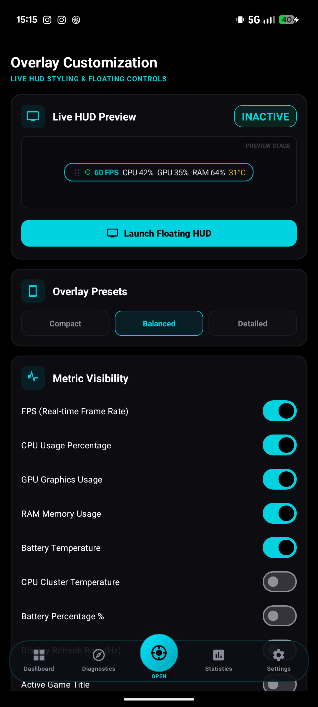
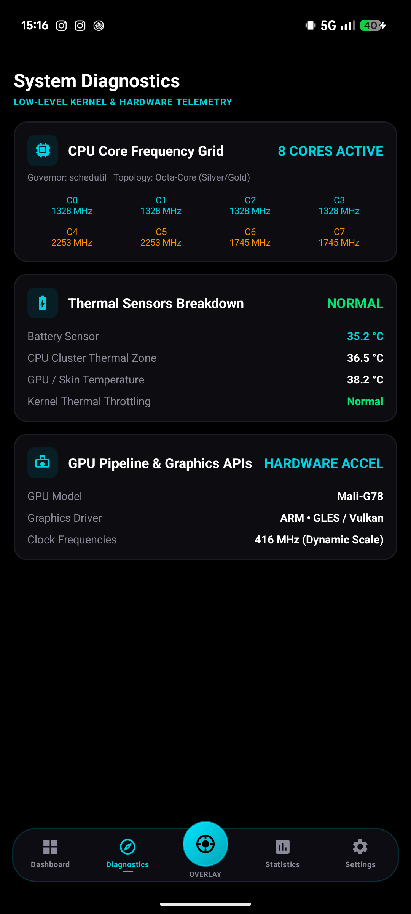
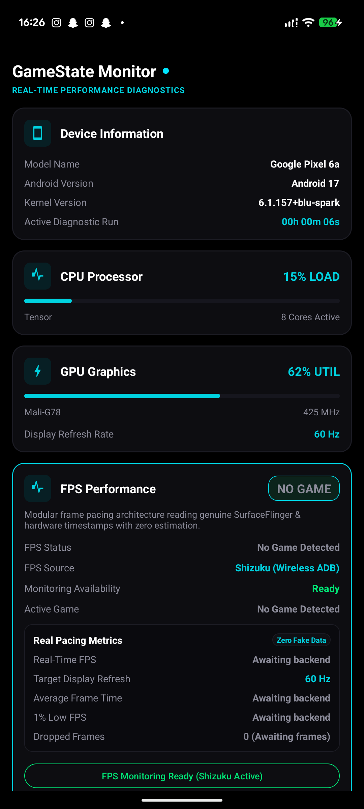

# 🎮 GameState Monitor

**Modern, high-precision Android gaming telemetry & floating in-game HUD overlay.**  
*Engineered with a pure OLED Black & Cyber Cyan aesthetic. Powered by Shizuku (Wireless ADB) for zero-root hardware precision.*

[-00D2E0?style=flat-square)](https://shizuku.rikka.app/)

[**Download Latest Release APK**](https://github.com/ayudh20/GameStateMonitor/releases/latest) • [**Features**](#-features) • [**Powered by Shizuku**](#-powered-by-shizukurootless-adb) • [**Screenshots**](#-screenshots) • [**Setup Guide**](#-quick-setup)

---

## 📸 Screenshots

<table>
  <tr>
    <td align="center" width="33%">
      <b>Real-Time Dashboard</b> 
      
    </td>
    <td align="center" width="33%">
      <b>In-Game Floating HUD</b> 
      
    </td>
    <td align="center" width="33%">
      <b>Overlay Controls & Presets</b> 
      
    </td>
  </tr>
  <tr>
    <td align="center" width="33%">
      <b>System Diagnostics & SoC</b> 
      
    </td>
    <td align="center" width="33%">
      <b>Shizuku (Wireless ADB) Engine</b> 
      
    </td>
    <td align="center" width="33%">
      <b>Circular Gauge Detail</b> 
      
    </td>
  </tr>
</table>

---

## ⚡ Features

### 🎮 Real-Time Floating In-Game HUD
- **Draggable, Zero-Lag Overlay**: Floats directly on top of any game (PUBG/BGMI, Genshin Impact, COD Mobile, emulators).
- **Comprehensive Telemetry**: Monitor FPS, CPU load %, GPU load %, RAM usage, Battery temperature, and clock speeds in real time.
- **3 One-Tap Density Presets**:
  - **Compact**: Minimalist single-line HUD designed for zero screen obstruction.
  - **Balanced**: Essential gaming metrics (FPS, CPU %, GPU %, Thermals).
  - **Detailed**: Full hardware diagnostic readout for benchmark sessions.
- **Granular Customization**: Toggle individual metrics on or off to tailor the HUD to your exact preferences.

### 🎯 Hardware-Level Frame Pacing (Zero Fake Data)
- **Direct SurfaceFlinger Telemetry**: Reads genuine presentation timestamps directly from Android's display compositor.
- **No Simulation or Approximations**: Unlike conventional apps that estimate frame rate based on screen refresh rate, GameState Monitor reads actual frame buffer completions.
- **Multi-Tier Backend**: Automatically leverages Shizuku (Wireless ADB) with automatic fallback for broad compatibility.

### 🖤 Pure OLED Black & Cyber Cyan Identity
- **Battery-Saving OLED Black (`#000000`)**: Completely black backgrounds for maximum contrast and zero power draw on AMOLED displays.
- **High-Voltage Cyber Cyan (`#00D2E0`)**: Unified, distraction-free visual theme inspired by premium handheld gaming utilities.
- **Circular System Health Arc Gauge**: Custom hardware-accelerated canvas gauge rendering a balanced 1:1 circular ring ($270^\circ$ sweep) displaying real-time system stability.
- **Real-Time Sparkline Waveforms**: Smooth Bézier curves illustrating live CPU, GPU, RAM, and storage utilization.

### 🧭 Floating Gaming Bottom Dock
- **Elevated Center Action**: One-tap quick toggle to launch or dismiss the floating HUD overlay.
- **5 Navigation Destinations**:
  1. **Dashboard**: Central command center and real-time hardware status.
  2. **Diagnostics**: Per-core CPU frequencies, thermal sensor zones, and GPU pipeline details.
  3. **Overlay**: Live HUD preview, density presets, and metric visibility switches.
  4. **Statistics**: Gameplay session histories, FPS stability charts, and thermal throttling analysis.
  5. **Settings**: Performance thresholds, monitoring intervals, and backend status.

---

## ⚡ Powered by Shizuku / Rootless ADB

### Why Shizuku?
On modern Android (Android 10+), Google strictly sandboxes standard applications from accessing system-wide graphics telemetry:
- Standard apps **cannot** read other applications' frame rates.
- Direct access to `dumpsys SurfaceFlinger` requires elevated `android.permission.DUMP`.

### How GameState Monitor Solves This (Without Root)
GameState Monitor integrates **[Shizuku](https://shizuku.rikka.app/)**, allowing it to execute privileged system calls through Android's built-in **Wireless Debugging (ADB)** environment.
- ✅ **No Root Required**: Keep your warranty intact and SafetyNet / Play Integrity passing.
- ✅ **No Bootloader Unlocking**: Works seamlessly on stock Android devices.
- ✅ **Microsecond Accuracy**: Extracts hardware timestamps directly from Android's compositor pipeline with zero estimation.

---

## 🚀 Quick Setup

### 1. Install GameState Monitor
Download and install the latest signed Release APK from the [Releases](https://github.com/ayudh20/GameStateMonitor/releases/latest) page.

### 2. Set Up Shizuku (Takes 1 Minute)
1. Install **[Shizuku](https://play.google.com/store/apps/details?id=moe.shizuku.privileged.api)** from Google Play (or GitHub).
2. Enable **Developer Options** and **Wireless Debugging** in your phone's Settings.
3. Open Shizuku and tap **Start via Wireless Debugging**.
4. Open **GameState Monitor** and grant Shizuku permission when prompted.
5. That's it! Real-time hardware FPS monitoring is now fully unlocked.

*(Optional: Grant "Display over other apps" permission to enable the Floating In-Game HUD).*

---

## 📥 Download

Get the latest stable release:

| Build | Package Type | Direct Download |
| :--- | :--- | :--- |
| **Latest Release (v1.0.0)** | Signed APK (Ready to Install) | [**Download `app-release.apk`**](https://github.com/ayudh20/GameStateMonitor/releases/latest) |
| **All Releases** | Changelogs & Historical Builds | [**View Releases**](https://github.com/ayudh20/GameStateMonitor/releases) |

---

## 📝 Release Notes (Latest)

### 🎨 Visual & Theme Overhaul
- Introduced pure OLED Black (`#000000`) high-contrast background.
- Standardized color palette to pure Cyber Cyan (`#00D2E0` / `#00E5FF`).
- Added dark glass card containers with subtle neon border strokes.
- Polished typography hierarchy and spacing across all cards.

### 🧭 Navigation & Gaming Dock
- Added floating glassmorphic bottom gaming dock with cyan glow border.
- Added 5 dedicated navigation destinations (Dashboard, Diagnostics, Overlay, Statistics, Settings).
- Added elevated circular center action button with gradient pulse glow.
- Added one-tap quick toggle to start and stop the floating HUD overlay.

### 🩺 System Health & Gauge Redesign
- Custom hardware-accelerated `SystemHealthArcView` with 1:1 circular ring geometry ($270^\circ$ sweep).
- Multi-stop cyan gradient sweep shader with smooth rounded caps.
- Real-time health score evaluation (`OPTIMAL`, `MODERATE`, `HIGH LOAD`).
- Integrated quick-glance thermal telemetry for CPU Temp, GPU Temp, and Battery %.

### 📊 Real-Time Telemetry Grid
- Custom `SparklineGraphView` real-time Bézier waveform graphs.
- Live CPU, GPU, RAM, and Storage telemetry cards with dual sub-metrics.

---

## 🛠️ Architecture & Tech Stack

- **Language**: Java (JDK 17 / 21)
- **Minimum SDK**: Android 8.0 (API Level 26)
- **Target SDK**: Android 14 (API Level 34)
- **Privileged Backend**: [Rikka Shizuku API](https://github.com/RikkaApps/Shizuku) (`v13.1.5`)
- **UI Components**: AndroidX, Material Design 3, Custom Canvas-Rendered Vector Views
- **CI/CD**: GitHub Actions automated release pipeline (`assembleRelease`)

---

## 📄 License

This project is licensed under the Apache License 2.0. See the [LICENSE](LICENSE) file for details.
